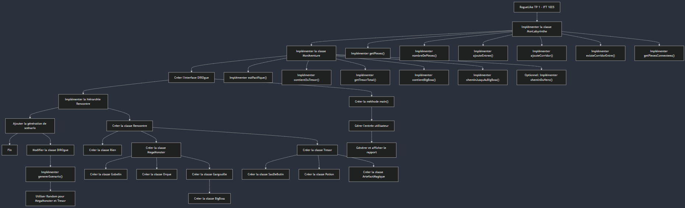

# RogueLike-TP1

Ce projet est réalisé dans le cadre du premier travail pratique du cours IFT1025 – Programmation 2 (Automne 2024). Le but de ce TP est de créer une infrastructure de base pour un jeu de type Rogue-like, en prenant le point de vue des testeurs de jeux vidéo.

Fonctionnalités principales :

	•	Représentation d’un labyrinthe (donjon) sous forme de graphe non orienté, utilisant des listes d’adjacence pour connecter les différentes pièces.
	•	Gestion des différentes rencontres (monstres, trésors, etc.) via une hiérarchie de classes.
	•	Implémentation d’une aventure dans le labyrinthe, avec des méthodes pour évaluer les dangers et trésors présents, ainsi qu’un chemin pour atteindre le boss.
	•	Génération d’un rapport et d’un scénario aléatoire pour chaque aventure.

Structure du projet :

	•	labyrinthe.soumission : Implémentation du labyrinthe et des méthodes associées.
	•	labyrinthe.rencontres : Hiérarchie de classes pour les différentes rencontres.
	•	DIROgue.java : Point d’entrée du programme, permettant à l’utilisateur de créer un labyrinthe via des commandes textuelles.
